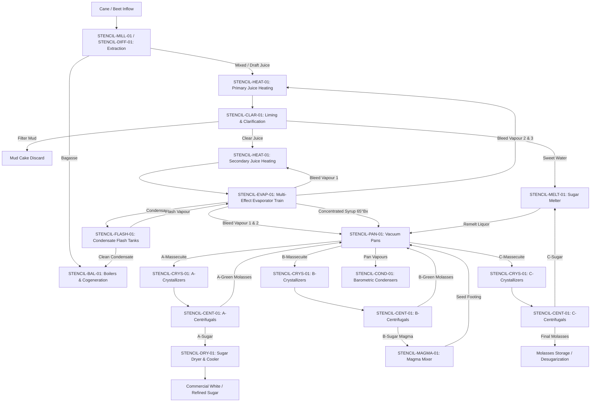

# Sugar Software Dependency Map & Directed Acyclic Graph (DAG)

> **Authoritative Basis**: `Sugar's Help Book` (`.agents/skills/sugars-helpbook/`)  
> **Agent 9: Sugar Stencil Architect**  
> **Scope**: Establishes global vs module-specific input ownership, cross-module stream handoffs, and intra-module calculation sequencing.

---

## 1. Global vs Module-Specific Input Boundary

To prevent input redundancy and ensure single-source data integrity across the flowsheet, all parameters are classified as either **Global** or **Module-Specific**:

### Global Parameters (Single Source of Truth)
- `plant_capacity_tch`: Factory cane/beet nominal processing rate ($t/h$).
- `campaign_days`: Factory operating season duration ($d$).
- `atmospheric_pressure_kpa`: Local ambient barometric pressure ($101.325\text{ kPa}$ at sea level).
- `cooling_water_supply_temp_c`: Factory river/cooling tower water inlet temperature ($25–32^\circ\text{C}$).
- `boiler_steam_pressure_bar`: Main high-pressure live steam header pressure ($45–110\text{ bar}$).
- `boiler_steam_temp_c`: Main live steam superheat temperature ($440–540^\circ\text{C}$).
- `exhaust_steam_pressure_kpa`: Process exhaust steam distribution header pressure ($150–250\text{ kPa abs}$).
- `solubility_model_default`: Factory-wide default sucrose solubility coefficients (Cane Typical vs Beet Typical).

### Module-Specific Parameters (Local to Station Unit)
- Equipment heat transfer area ($A$), heat transfer coefficient ($U$), heat loss fraction ($f_{loss}$).
- Stage operating pressures ($P_{body}$), saturation temperatures ($T_{sat}$).
- Target process setpoints (e.g., target syrup Brix, target massecuite DS, target supersaturation $S_s$).
- Machine mechanical parameters (e.g., centrifugal basket speed, screen perforation, purge factors $Z_g, P_w$).

---

## 2. Cross-Module Process Train Directed Graph



---

## 3. Field-Level Directed Acyclic Graphs (DAG)

### 3.1 Cane Extraction & Mixed Juice DAG
```text
[Cane Crushing (TCH)] ───────────────┐
                                      ├──→ [Cane Mass Flow (kg/h)] ─────────┐
[Cane Fiber %] ──────────────────────┘                                       │
                                                                             ├──→ [Bagasse Flow (kg/h)]
[Bagasse Fiber %] ───────────────────────────────────────────────────────────┤          │
                                                                             │          ▼
[Imbibition Water % Cane] ──────────→ [Imbibition Flow (kg/h)] ──────────────┼──→ [Mixed Juice Flow]
                                                                             │          │
[Cane Pol %] ───────────────────────→ [Pol in Cane (kg/h)] ──────────────────┘          ▼
                                                                                   [Mixed Juice Brix]
                                                                                        │
                                                                                        ▼
                                                                                   [Pol Extraction %]
```

---

### 3.2 Evaporator Single Effect Thermal DAG
```text
[Juice In Flow (kg/h)] ──────────────┐
[Juice In Brix %] ───────────────────┼──→ [Dry Solids Flow D_in (kg/h)] ───┐
[Target Syrup Brix %] ───────────────┘                                      ├──→ [Syrup Flow Out (kg/h)]
                                                                            │          │
                                                                            │          ▼
                                                                            └──→ [Evaporation Rate (kg/h)]
                                                                                       │
[Vapour Pressure (kPa)] ─────────────┐                                                 │
                                     ├──→ [Saturation Temp T_sat] ───────┐             │
[Bubník-Kadlec BPE Algorithm] ───────┤                                   ├──→ [Latent Heat λ_vap]
[Syrup Purity %] ────────────────────┘                                   │             │
                                                                         │             ▼
[Juice In Temp (°C)] ────────────────┐                                   └──→ [Process Heat Q_process]
[Bartens Syrup Cp Algorithm] ────────┴──→ [Sensible Heat Q_sens] ──────────────────────┤
                                                                                       ▼
[Calandria Steam Pressure] ──────────┐                                            [Gross Heat Q_gross]
[Calandria Condensate Subcooling] ───┴──→ [Steam Enthalpy Drop Δh_steam] ──────────────┤
                                                                                       ▼
                                                                                  [Motive Steam Required]
```

---

### 3.3 Vacuum Pan Evaporative Crystallization DAG
```text
[Feed Liquor Flow (kg/h)] ───────────┐
[Feed Liquor Brix %] ────────────────┼──→ [Solids Flow D_feed] ──────────┐
[Feed Liquor Purity %] ──────────────┘                                    │
                                                                          ├──→ [Massecuite Flow M_mc]
[Target Massecuite DS %] ─────────────────────────────────────────────────┤          │
                                                                          │          ▼
[Target Mother Liquor SS] ───────────┐                                    └──→ [Evaporated Vapour V]
[Vavrinecz Solubility Coefs a,b,c] ──┼──→ [Mother Liquor Saturation]                 │
[Operating Vacuum / Pressure] ───────┤                                               ▼
[Kadlec BPE Algorithm] ──────────────┴──→ [Boiling Temp T_boil] ─────────────→ [Calandria Steam Flow]
                                                │
                                                ▼
                                         [Mother Liquor DS_ml & PU_ml]
                                                │
                                                ▼
                                         [Crystal Content X_c (%)]
                                                │
                                                ▼
                                         [Total Crystal Sugar Yield (kg/h)]
```

---

### 3.4 Centrifugal Separation DAG
```text
[Massecuite Flow (kg/h)] ────────────┐
[Massecuite Crystal Content X_c] ────┼──→ [Crystal Sucrose In (kg/h)]
[Massecuite Mother Liquor Flow] ─────┘          │
                                                ├──→ [Purged to Green Molasses] ──→ [Green Molasses Flow]
[Wash Water Ratio (kg/kg mc)] ───────┐          │
[Wash Water Temp (°C)] ──────────────┼──→ [Purged to Wash Molasses] ───→ [Wash Molasses Flow]
[Purge Efficiency Z_g & P_w] ────────┘          │
                                                ▼
                                         [Crystal Dissolution in Wash]
                                                │
                                                ▼
                                         [Net Commercial Sugar Yield]
                                                │
                                                ▼
                                         [Sugar Pol & Moisture %]
```
